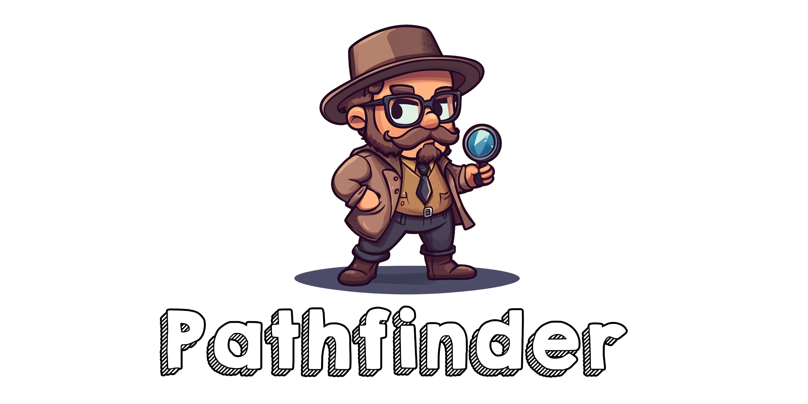
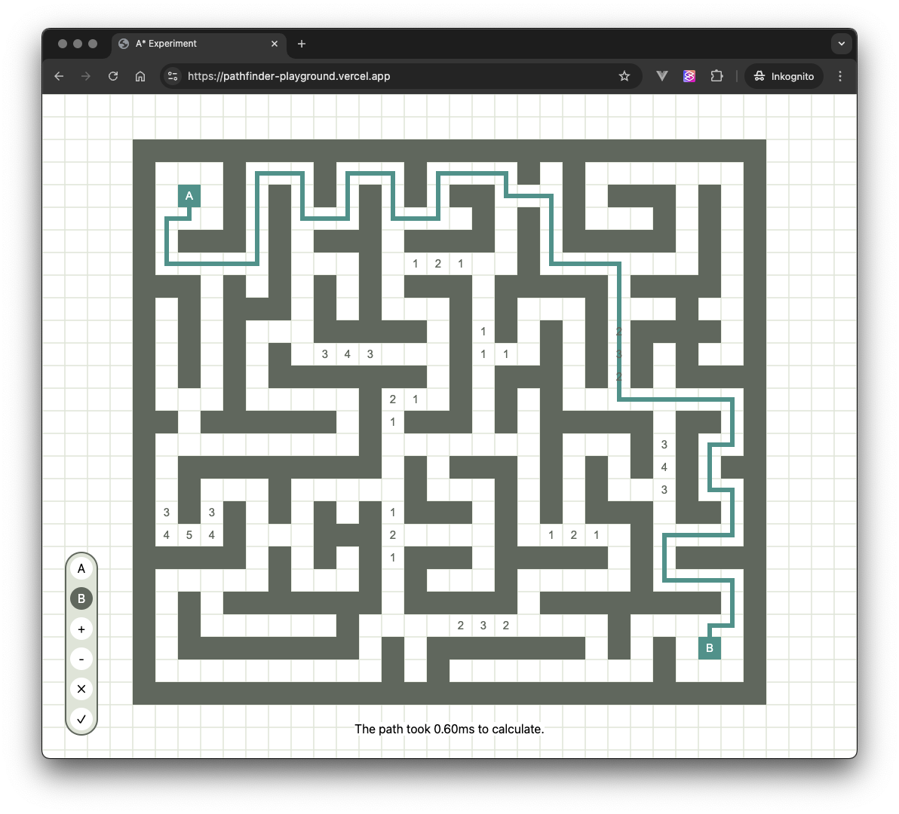

Welcome to my "Pathfinder Playground" repository! Here I am experimenting with pathfinding, specifically A* for a
different project.

This repository is for educational purposes and to share and document my approach.
Feel free to explore, modify, and use any code you find here for your own learning and
projects.

The current progress is deployed as https://pathfinder-playground.vercel.app/, but might change at any point,
since this is very much a playground.

## How to use it?

1. Access the [Webapp](https://pathfinder-playground.vercel.app/).
2. Add a Token A and B - the algorithm will try and find the cheapest path between the two points.
3. Change weights of cells or block them off entirely to make it path around.

## What are "weights"?

This follows the Graph Theory naming convention
for [weighted graphs](https://en.wikipedia.org/wiki/Graph_(discrete_mathematics)#Weighted_graph).

If you imagine the pathfinder on an actual map, "weights" might refer to the equivalent of a hill in between for
example.

Sometimes it's just easier to walk around it. Sometimes it is not.
The base weight for each cell is "0".

## What does "cheapest path" mean?

Again, this follows Graph Theory naming conventions.

Meaning, it doesn't find the shortest path (as in "number of cells it crosses") but factors in how much each cell adds
to the
total cost - so a small cluster of "Weight 9" cells might be a lot more costly than a large cluster of "Weight 1" cells.

## What algorithm is it using?

This is my best attempt at writing an [A* implementation](https://de.wikipedia.org/wiki/A*-Algorithmus).

## Known Bugs

The Pathfinding is as bug-free as I can make it. But the UI might need some more guardrails, so that the user can't
create states that end in infinite loops (like placing the B token on a blocked tile).

Also right now the Algo itself doesn't take into account the current viewport - it just assumes, everything outside the
viewport is fair game. That means it might path around your obstacle by pathfinding outside your viewable area.
If this happens to you, you will need to manually block that path for them for now.

Both are fairly easy to fix, but weren't the focus here, so I didn't bother yet.

## Credits

Parts of the implementation has been inspired by [Red Blob Games Blog](https://www.redblobgames.com/) Entry on
[Pathfinding](https://www.redblobgames.com/pathfinding/a-star/implementation.html).
